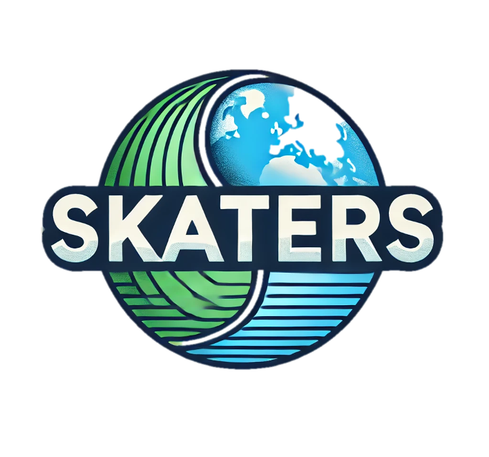

<!-- center the header title -->

  
<em>(Scientists for Knowledge of ATmospheric invERSions)</em>

**SKATERS** is an open, collaborative community for scientists working on **inverse modeling of atmospheric trace gases**.  
We connect researchers who want to share methods, code, data, and experiences — especially those who might be the only person in their group using these techniques.

Because inverse modeling is a specialized and evolving field, our members often face unique technical and methodological challenges. SKATERS is here to help bridge those gaps by providing a space to learn from one another, ask questions, and collaborate.

---

## What we offer
1. **Monthly one-hour online meetings** featuring deep-dive presentations and open discussions on inversion methods.
2. A place to **share code, data, and resources** related to atmospheric inversions.
3. A **community of peers** who can help troubleshoot issues, share best practices, and provide feedback on your work.
4. A platform to **announce job postings** and opportunities relevant to our members.
5. A **mailing list** for announcements and community updates

---

## Get involved
Anyone at any career stage interested in atmospheric inverse modeling is welcome to join.  
See our [Contact](/contact/) pages for details on and how to get in touch.